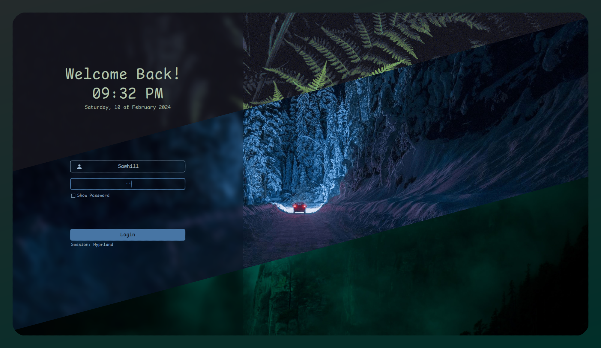
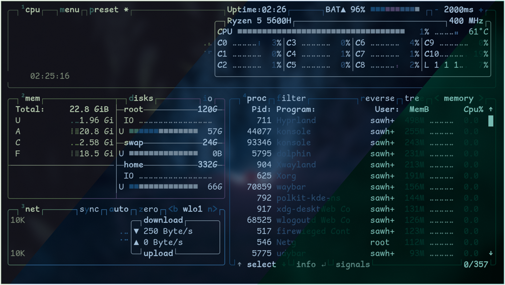
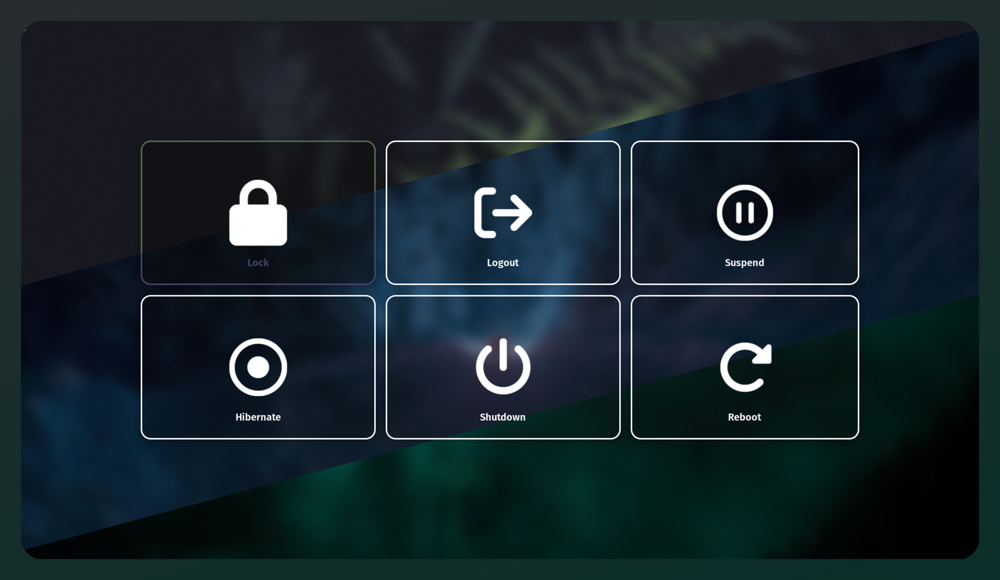

# Aestishot.sh

## Showcase





## Description
`aestishot.sh` is a Bash script designed to merge multiple images into a seamless, gradient-background image. It's particularly useful for creating composite images showcasing different color schemes or themes, each represented by a section of the final output image.

## Usage
```bash
aestishot.sh [options] <image1> <image2> ....<imageN>
```

### Options
- `-h`: Prints usage information.
- `-p <padding>`: Sets the padding size for the gradient background (default: 80).
- `-r <radius>`: Sets the corner radius for the output image (default: 20).
- `-a <angle>`: Sets the angle to rotate the output image by (default: 9).
- `-t <png|jpeg|...|tiff>`: Sets the file format for the output image (default: png).
- `-o <file Name>`: Sets the name of the output file (default: output.png).
- `-gf <color>`: Specifies the gradient from-color (default: generated from the first supplied image).
- `-gt <color>`: Specifies the gradient to-color (default: generated from the last supplied image).
- `-ga <angle>`: Specifies the gradient angle (default: 180-angle).
  
### Example
```bash
aestishot.sh -r 25 -p 32 -a 9 -gf "#ff0000" -gt "#00ff00" -ga 90 -t png -o myoutput images*.png
```

## How It Works
The script takes multiple input images and merges them into a single output image. It applies a gradient background to seamlessly blend the images together. You can customize various parameters such as padding, corner radius, rotation angle, file format, output file name, gradient colors, and gradient angle to achieve the desired visual effect.

Technically, the script performs the following steps:
1. Rotate each input image by a specified angle.
2. Crop each image to a 1/total_images fraction of the total height.
3. Join the cropped images vertically.
4. Add rounded rectagle mask to the joined image.
5. Add gradient background to the masked image.

## Caveats
- The script works best with images of similar dimensions.
- This script may reduce the quality of the images as we are doing rotations
without clipping which add extra padding and then removing that padding. ( I
tired with python Pillow and openCV the quality was similar to that one)

## Requirements
- Bash shell environment.
- ImageMagick (for image processing operations).

## Installation
No formal installation is required. Simply download `aestishot.sh` to your desired location and ensure it has executable permissions (`chmod +x aestishot.sh`) to run it as a command. 

or you can run the following command to download the script:
```bash
curl -O https://raw.githubusercontent.com/Sahil-958/seamless_screenshots/main/aestishot.sh && chmod +x aestishot.sh
```

## Credits
This script utilizes the ImageMagick library for image processing operations.

